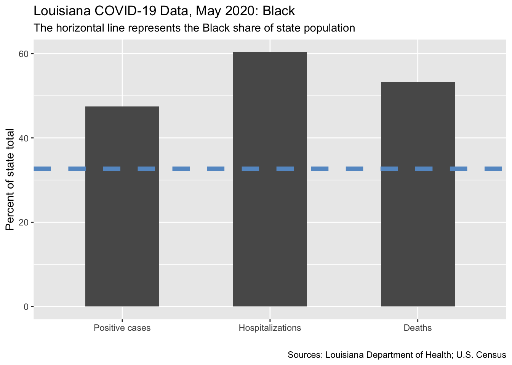
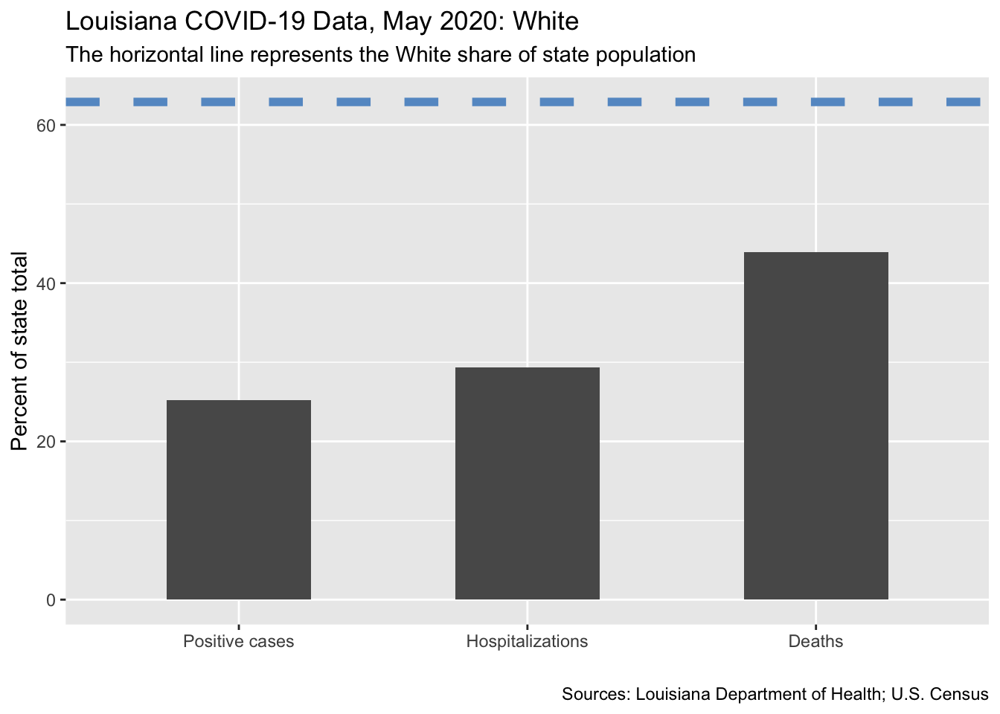
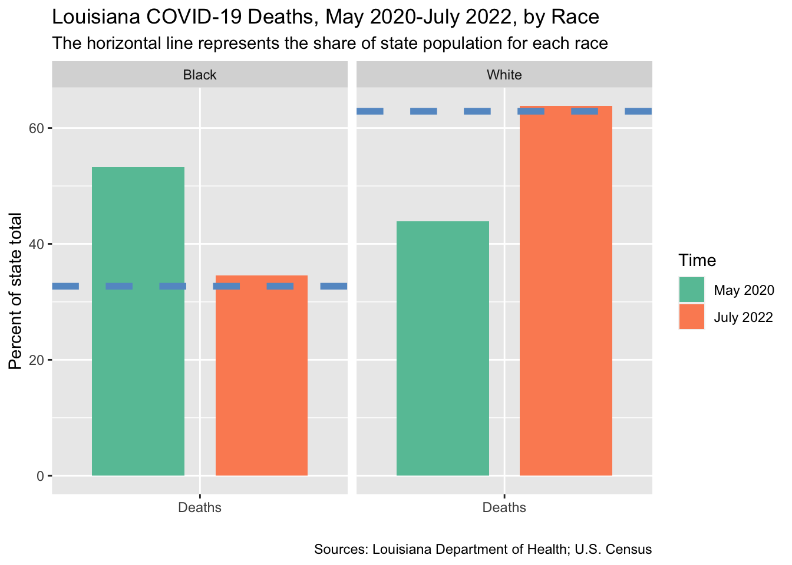

# Racial iequality in COVID-19 mortality in Louisiana

This repo shows data on racial inequality in COVID-19 mortality in Louisiana. It is part of my work for the Louisiana COVID-19 Health Equity Task Force. See the [full report](https://www.sus.edu/assets/LaCOVID/AUGUST-COVID-Task-Force-Subcommittee-Reports.pdf) and my [short project](https://sites.google.com/view/simone-rambotti/portfolio/taskforce). It includes:

- `taskforce.R`: R script
- `taskforce.Rmd`: R Markdown
- `black_may2020.png`: COVID-19 outcomes among black residents of Louisiana, May 2020 (see below)
- `white_may2020.png`: COVID-19 outcomes among white residents of Louisiana, May 2020 (see below)
- `black_white_july2022.png`: COVID-19 outcomes among black and white residents of Louisiana, May 2020-July 2022 (see below)

